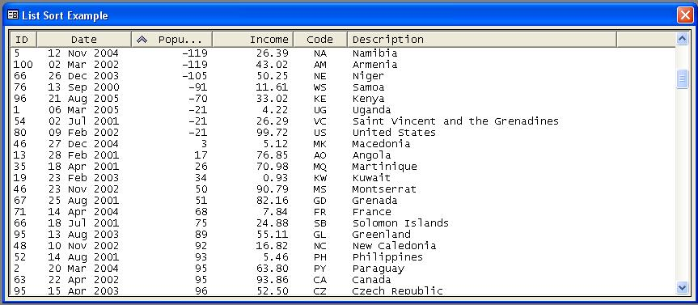



## ListView Column Sorting / Sorter

### Description

Sorting a ListView containing Dates and Numerics can be painful. Here is a solution, that is virtually seamless.

The sort now handles positive and negative numbers as well as Dates and or Times.

It works by creating a temporary column at run-time and populating it with the content of the column that is being sorted. The type of sort carried out i.e. Numeric, Date or String is controlled via the columns TAG value.
 
### More Info
 

             |
---                |---
**Submitted On**   |2005-04-21 15:57:18
**By**             |[Nick\.Adie](https://github.com/Planet-Source-Code/PSCIndex/blob/master/ByAuthor/nick-adie.md)
**Level**          |Advanced
**User Rating**    |4.9 (39 globes from 8 users)
**Compatibility**  |VB 6\.0
**Category**       |[Libraries](https://github.com/Planet-Source-Code/PSCIndex/blob/master/ByCategory/libraries__1-49.md)
**World**          |[Visual Basic](https://github.com/Planet-Source-Code/PSCIndex/blob/master/ByWorld/visual-basic.md)
**Archive File**   |[ListView\_S1879554212005\.zip](https://github.com/Planet-Source-Code/nick-adie-listview-column-sorting-sorter__1-60137/archive/master.zip)

